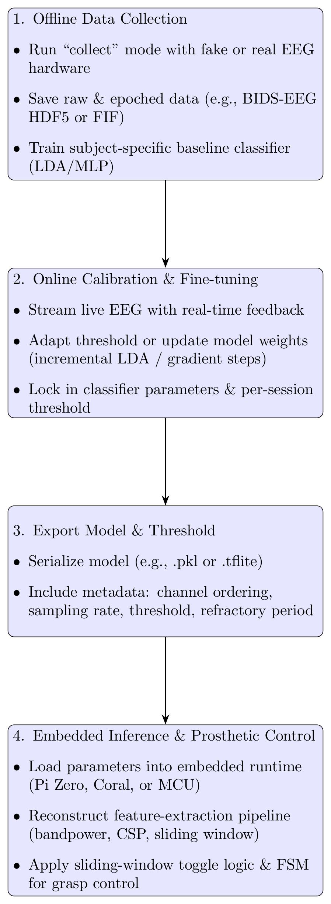

# Prosthetic-MI-BCI

[](#requirements)  
[](LICENSE)  
[](#)

A toggle-based motor-imagery BCI pipeline for prosthetic grasp control.  
Collect EEG, train a subject-specific classifier, and run inference on an embedded device—all in one repo.

---

## 🚀 Table of Contents

1. [Features](#✨-features)  
2. [Architecture](#🏗-architecture)  
3. [Hardware](#🧩-hardware)  
4. [Pipeline Diagram](#📊-bci-pipeline-flow-diagram)  
5. [Quick Start](#🚀-quick-start)  
6. [License](#📄-license)  

---

## ✨ Features

- **Offline collection**: record 5–8 min of EEG, segment into epochs (BIDS-EEG HDF5/FIF).  
- **Online calibration**: real-time confidence bar + threshold/adaptive tuning.  
- **Embedded inference**: run LDA or quantized MLP on Raspberry Pi Zero / Coral Edge TPU / MCU.  
- **Toggle FSM**: one mental “hit” flips prosthetic open/close state.  
- **Extensible**: swap hardware interfaces, add new commands or front-ends.  

---

## 🏗 Architecture

1. **collect** – record & save raw/epoched EEG  
2. **train**   – fine-tune classifier & threshold with live feedback  
3. **export**  – serialize model (`.pkl` / `.tflite`) + metadata  
4. **infer**   – embedded runtime loads model, runs sliding-window toggle logic  

---

## 🧩 Hardware

This pipeline was developed and tested with:

- **OpenBCI Cyton Biosensing Board (8-channel, 250 Hz)** – USB or BLE connection; BrainFlow API support  
  https://shop.openbci.com/products/cyton-biosensing-board-8-channel?_pos=2&_fid=a378dc910&_ss=c  
- **Ultracortex “Mark IV” EEG Headset (8-channel)** – comfortable head-mounted electrode array  
  https://shop.openbci.com/products/ultracortex-mark-iv?_pos=5&_fid=a378dc910&_ss=c  

Other BrainFlow-supported boards (PiEEG, Muse, Ganglion) can also be used by changing the `board_id` in `config.yaml`.

---

## 📊 BCI Pipeline Flow Diagram

<p align="center">
  
</p>

---

## 🚀 Quick Start

1. **Clone the repo**  
   ```bash
   git clone https://github.com/fletchere171/Prosthetic-MI-BCI.git
   cd Prosthetic-MI-BCI

2. **Create & activate a virtual environment**  
   ```bash
   python3 -m venv .venv
   source .venv/bin/activate      # macOS/Linux
   .\.venv\Scripts\activate       # Windows

3. **Install dependencies**  
   ```bash
   pip install -r requirements.txt

## 📄 License
This project is licensed under the **MIT License**.  
See the [LICENSE](LICENSE) file for full text and details.